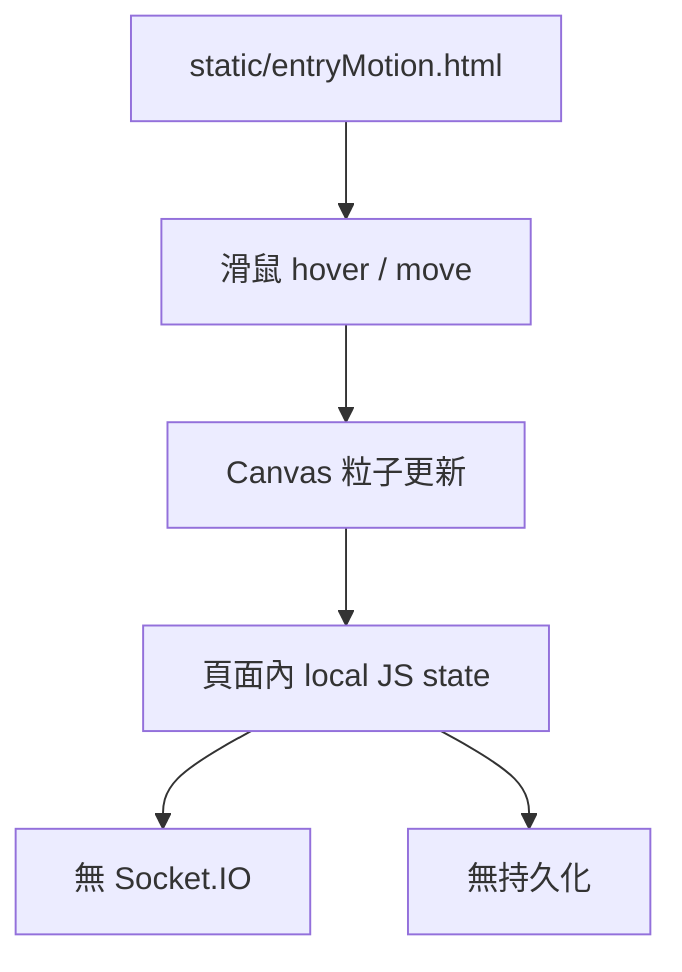
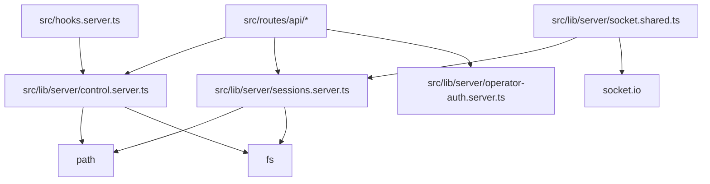
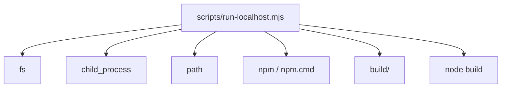
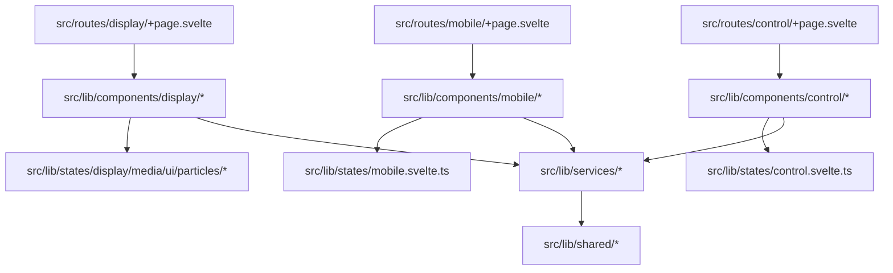
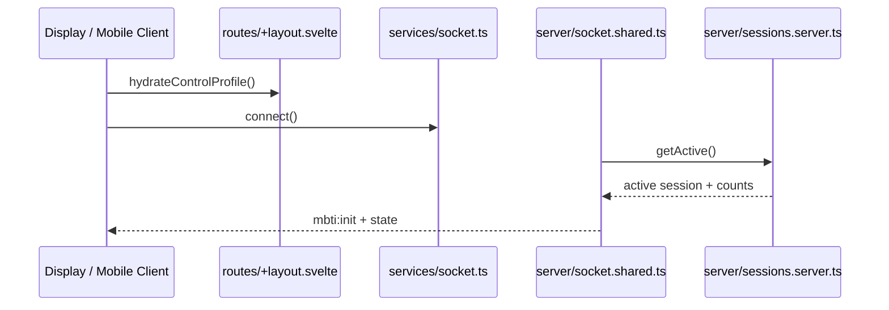
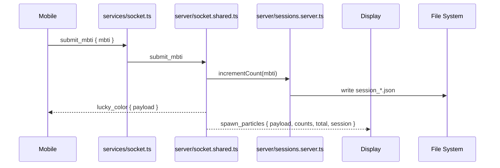
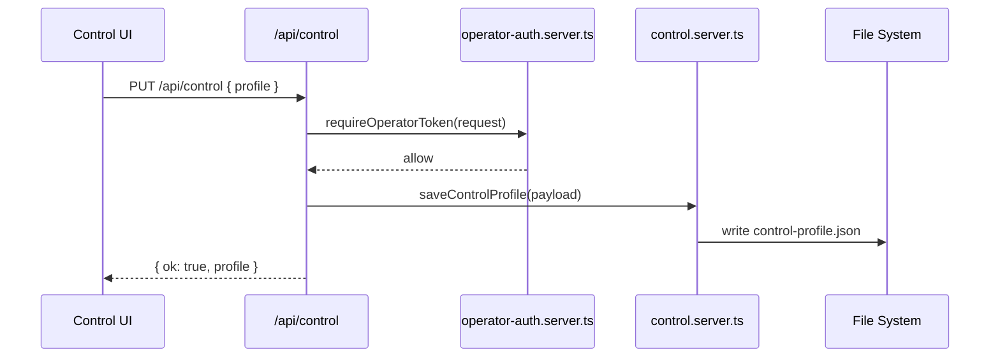

# InkLumina 專案架構說明書

> 版本：release/ref-sv-v3  
> 目的：完整說明專案整體架構、資料流、模組依賴、以及各子目錄與文件用途。  
> 範圍：以目前分支可見檔案為準，包含根目錄、`.devnotes/`、`build/`、`data/`、`src/`、`static/`、`scripts/`、`prompts/`、`devnotes/`、`.github/`、`.vscode/`。

---

## 1. 專案總覽

InkLumina 是一個以 **SvelteKit + TypeScript + Vite** 建置的現場互動系統，現行主體由三條前端路由與兩條 server-side 通道組成：

- **Display route `/display`**：大螢幕粒子畫布、手勢/表情偵測、Session 面板、QR join 與現場狀態顯示。
- **Mobile route `/mobile`**：手機端 MBTI 選擇、結果卡片生成與提交流程。
- **Control route `/control`**：camera、粒子、network、MBTI palette 與 server 參數的可視化控制面板。
- **REST API `/api/*`**：提供 control profile 與 session 歷史的讀寫入口。
- **Socket.IO**：負責 mobile -> server -> display 的即時同步。

目前專案的主要組成不是單檔 HTML page，而是：

- **正式 Web App**：SvelteKit routes 與 `src/lib/components/*`。
- **即時同步層**：`src/lib/shared/contracts.ts`、`src/lib/services/socket.ts`、`src/lib/server/socket.shared.ts`。
- **資料持久層**：`data/sessions/*.json` 與首次保存 control profile 時才建立的 `data/control/control-profile.json`。
- **啟動與建置層**：`scripts/`、`build/`、Windows/macOS launcher。
- **靜態參考頁**：`static/entryMotion.html`，作為獨立互動示範，不是主要 app route。

---

## 2. 專案目錄樹

```text

inklumina/
├── .devnotes/             # 實際的時間戳開發快照與變更追蹤索引
│   ├── DEVNOTES.md
│   ├── DEVNOTES_LOGS.md
...
├── .github/               # Copilot / agent 規範與 repository-level 指示
│   └── copilot-instructions.md
├── build/                 # SvelteKit production build 輸出，包含 client/server/socket
│   ├── client/
│   ├── server/
│   └── socket/
├── data/                  # runtime persistence 資料
│   ├── control/           # 首次保存 control profile 時 lazy-create
│   │   └── control-profile.json
│   └── sessions/
│       ├── session_*.json
...
├── devnotes/              # 長文架構文件、補充說明與人工整理的技術文檔
│   └── DEVNOTES.md
├── prompts/               # prompt 資產、模板與測試資料
│   ├── AGENTS.md
│   ├── README.md
│   ├── prompt_template.md
│   ├── ai/
│   ├── mapping/
│   └── tests/
├── scripts/               # localhost / build 啟動輔助腳本
│   └── run-localhost.mjs
├── src/                   # 現行 SvelteKit source tree
│   ├── app.d.ts
│   ├── app.html
│   ├── hooks.server.ts
│   ├── lib/
│   │   ├── assets/
│   │   │   └── favicon.svg
│   │   ├── components/
│   │   │   ├── control/
│   │   │   │   └── ControlPanel.svelte
│   │   │   ├── display/
│   │   │   │   ├── Canvas.svelte
│   │   │   │   ├── Header.svelte
│   │   │   │   ├── Legend.svelte
│   │   │   │   ├── SessionPanel.svelte
│   │   │   │   └── ...
│   │   │   └── mobile/
│   │   │       ├── MBTIMobilePage.svelte
│   │   │       ├── MBTICard.svelte
│   │   │       ├── HoloCardPreview.svelte
│   │   │       └── ...
│   │   ├── config/
│   │   │   ├── public.ts
│   │   │   ├── server.ts
│   │   │   ├── session.ts
│   │   │   └── config.js
│   │   ├── server/
│   │   │   ├── control.server.ts
│   │   │   ├── sessions.server.ts
│   │   │   ├── socket.server.ts
│   │   │   ├── socket.shared.ts
│   │   │   └── ...
│   │   ├── services/
│   │   │   ├── display/
│   │   │   │   ├── camera.ts
│   │   │   │   ├── core.ts
│   │   │   │   ├── draw.ts
│   │   │   │   ├── gesture.ts
│   │   │   │   ├── particle.ts
│   │   │   │   ├── particleEngine.ts
│   │   │   │   ├── realtime.ts
│   │   │   │   ├── sprite.ts
│   │   │   │   └── types.ts
│   │   │   ├── mobile/
│   │   │   │   ├── mobile.holo.ts
│   │   │   │   └── mobile.logic.ts
│   │   │   ├── control.shared.ts
│   │   │   ├── control.ts
│   │   │   ├── mediapipe.ts
│   │   │   ├── operator.ts
│   │   │   ├── session.ts
│   │   │   ├── socket-client.ts
│   │   │   └── socket.ts
│   │   ├── settings/
│   │   │   ├── display.ts
│   │   │   ├── index.ts
│   │   │   ├── network.ts
│   │   │   ├── settings.ts
│   │   │   └── vision.ts
│   │   ├── shared/
│   │   │   ├── constants/
│   │   │   │   ├── mbti.ts
│   │   │   │   └── vision.ts
│   │   │   └── contracts.ts
│   │   ├── states/
│   │   │   ├── control.svelte.ts
│   │   │   ├── display.svelte.ts
│   │   │   ├── media.svelte.ts
│   │   │   ├── mobile.svelte.ts
│   │   │   ├── particles.svelte.ts
│   │   │   └── ...
│   │   ├── styles/
│   │   │   ├── display.css
│   │   │   ├── global.css
│   │   │   ├── mobile.css
│   │   │   └── tokens.css
│   │   ├── types/
│   │   │   ├── control.ts
│   │   │   ├── display.ts
│   │   │   ├── index.d.ts
│   │   │   ├── media.ts
│   │   │   └── mobile.d.ts
│   │   ├── utils/        # 目前為空，保留作 legacy cleanup 緩衝區
│   │   └── index.ts
│   └── routes/
│       ├── +layout.svelte
│       ├── +page.svelte
│       ├── +page.ts
│       ├── api/
│       │   ├── control/
│       │   │   └── +server.ts
│       │   └── sessions/
│       │       ├── +server.ts
│       │       ├── new/
│       │       │   └── +server.ts
│       │       └── [id]/
│       │           └── +server.ts
│       ├── control/
│       │   └── +page.svelte
│       ├── display/
│       │   ├── +page.svelte
│       │   └── +page.ts
│       └── mobile/
│           └── +page.svelte
├── static/                # 保留的靜態資產與獨立示範頁
│   ├── entryMotion.html
│   └── robots.txt
├── ARCHITECTURE.md
├── AGENTS.md
├── CONVENTIONS.md
├── README.md
├── Start-InkLumina.bat
├── Start-InkLumina.command
├── package.json
├── svelte.config.js
├── tsconfig.json
├── tsconfig.function.json
├── tsconfig.socket.json
└── vite.config.ts

```

---

## 3. 系統架構總圖

### 3.1 邏輯分層

```mermaid
flowchart TB
  subgraph Browser[Browser]
    D[Display /display]
    M[Mobile /mobile]
    C[Control /control]
    E0[Standalone static/entryMotion.html]
  end

  subgraph NodeServer[SvelteKit + Socket.IO]
    R[SvelteKit routes]
    A[REST API /api/control /api/sessions/*]
    S[Socket.IO 即時事件]
    H[src/hooks.server.ts]
  end

  subgraph Storage[File System]
    J[data/sessions/*.json]
    K[data/control/control-profile.json\n(lazy-create)]
    B[build/]
    T[static/]
  end

  D <-->|HTTP / Socket.IO| R
  M <-->|HTTP / Socket.IO| R
  C <-->|HTTP / REST| R
  E0 --> T

  R --> A
  R --> S
  R --> H
  A --> J
  A --> K
  S --> J
  H --> K
  R --> B
```

### 3.2 實作層次

```mermaid
flowchart TB
  Presentation[Presentation Layer]
  Orchestration[State and Service Layer]
  Domain[Shared Domain Layer]
  Infra[Infrastructure Layer]

  Presentation --> Orchestration
  Orchestration --> Domain
  Domain --> Infra

  Presentation --> ["routes/*\ncomponents/*\nstyles/*"]
  Orchestration --> ["states/*.svelte.ts\nservices/*\nroute bootstrap logic"]
  Domain --> ["shared/constants/*\nshared/contracts.ts\nconfig/*\nsettings/*\ntypes/*"]
  Infra --> ["lib/server/*\ndata/* persistence\nVite / SvelteKit build\nlauncher scripts"]
```

---

## 4. 資料流圖

### 4.1 主要資料流：Mobile → Server → Display

```mermaid
flowchart LR
  A[Mobile route /mobile]
  B[使用者完成 MBTI]
  C[services/socket.ts emit submit_mbti]
  D[server/socket.shared.ts]
  E[驗證與正規化 MBTI]
  F[sessions.server.ts incrementCount]
  G[寫回 data/sessions/*.json]
  H[組出 lucky_color / spawn_particles payload]
  I[Display route /display]
  J[services/display/realtime.ts]
  K[更新 legend / footer / particles]

  A --> B --> C --> D --> E --> F --> G --> H
  H --> A
  H --> I --> J --> K
```



### 4.2 Control / Session 持久化資料流

```mermaid
flowchart TB
  A[任何 request 進入]
  B[src/hooks.server.ts]
  C[ensureControlProfileLoaded()]
  D[data/control/control-profile.json\n(lazy-create)]
  E[/api/control]
  F[src/lib/server/control.server.ts]
  G[/api/sessions*]
  H[src/lib/server/sessions.server.ts]
  I[data/sessions/*.json]

  A --> B --> C
  C --> D
  E --> F --> D
  G --> H --> I
```

### 4.3 `static/entryMotion.html` 資料流



---

## 5. 模組依賴圖

### 5.1 伺服器核心依賴



### 5.2 SvelteKit 前端依賴

```mermaid
graph TD
  svelteconfig[svelte.config.js]
  viteconfig[vite.config.ts]
  tsconfig[tsconfig.json]
  tsfunction[tsconfig.function.json]
  tssocket[tsconfig.socket.json]

  adapter[@sveltejs/adapter-node]
  kitvite[@sveltejs/kit/vite]
  vite[vite]
  plugin[src/lib/server/vite-socket-plugin.ts]
  baseconfig[.svelte-kit/tsconfig.json]

  svelteconfig --> adapter
  viteconfig --> kitvite
  viteconfig --> vite
  viteconfig --> plugin
  tsconfig --> baseconfig
  tsfunction --> tsconfig
  tssocket --> tsconfig
```

### 5.3 Runtime / build 流程依賴



### 5.4 前端 runtime 依賴



---

## 6. 根目錄與主要子目錄說明

### 6.1 `README.md`

對外與新進開發者使用的入口說明，涵蓋：

- 專案簡介
- `npm run dev` / `npm run build` / `npm run check`
- `npm run release:localhost` 的本機 production 啟動方式
- Windows / macOS 一鍵啟動腳本用法

### 6.2 `AGENTS.md`

repo 內給 AI coding agent 的工作指南，重點放在：

- 技術棧與常用命令
- 非破壞性修改原則
- UI / shared component 變更前的注意事項
- 變更後需跑 `npm run check`

### 6.3 `.devnotes/`

實際使用的時間戳快照目錄。每次較大修改會新增 `DEVNOTES_{ISO_TIMESTAMP}.md`，保存：

- 當次變更背景
- 計畫與待辦
- 實際結果
- 影響範圍

### 6.4 `devnotes/`

偏向長文與人工整理的技術文檔區，和 `.devnotes/` 的用途不同：

- `DEVNOTES.md`：人工索引／政策說明，會引用 `.devnotes/` 的快照
- 其他檔案：架構補充、歷史整理、策略說明

根目錄的 `ARCHITECTURE.md` 則作為目前 repo 結構與資料流的主說明文件。

### 6.5 `data/`

runtime persistence 的根目錄：

- `data/sessions/*.json`：每一場 session 一份 JSON，而不是單一總表檔
- `data/control/control-profile.json`：control panel 的持久化設定與可選 operator token，會在第一次保存 control profile 時才建立

### 6.6 `build/`

SvelteKit build 後的產物目錄，包含：

- `build/client/`：前端靜態輸出
- `build/server/`：SSR / route server 輸出
- `build/socket/`：socket 相關 build 產物

這個目錄是 generated output，不是原始碼。

### 6.7 `package.json`

定義專案 scripts 與依賴，實際開發常用指令包含：

- `npm run dev`
- `npm run build`
- `npm run preview`
- `npm run check`
- `npm run release:localhost`

### 6.8 `svelte.config.js` / `vite.config.ts`

兩者共同決定 SvelteKit runtime 與 build 行為：

- `svelte.config.js`：`adapter-node`、Svelte 相關編譯設定
- `vite.config.ts`：SvelteKit plugin 與自訂 socket plugin 掛接

### 6.9 `tsconfig*.json`

目前 repo 中有多份 TS config，各自角色不同：

- `tsconfig.json`：主 TypeScript 設定
- `tsconfig.socket.json`：socket 相關型別/編譯切分
- `tsconfig.function.json`：歷史遺留的 function-area config；現行 active source tree 已不再以 `src/lib/function/` 為核心

### 6.10 `Start-InkLumina.bat` / `Start-InkLumina.command`

給非 CLI 使用者的直接啟動入口：

- 自動檢查 Node / npm
- 安裝依賴
- 視需要建置 production assets
- 啟動 localhost server 並打開 display route

### 6.11 `scripts/run-localhost.mjs`

一個偏 release-like 的啟動器：若缺少 `build/` 會先 build，再以固定 host/port 啟動產物。

### 6.12 其他根目錄檔案

- `.gitignore`：忽略 build、`node_modules`、runtime data 等
- `.npmrc`：啟用 `engine-strict=true`
- `.ref/`：參考材料或整理中的補助資料，不屬於主 runtime

---

## 7. `.github/` 子目錄說明

`.github/` 主要承載 AI 協作與 repo 級規範。對本專案最重要的是：

- `copilot-instructions.md`：要求依照 Svelte 5 / TS first / runes 的方向整理專案
- 相關 agent / skill 文件：用來約束 AI 修改流程、說明保護區與 devnotes 規則

這一層不是 app runtime 的一部分，但會直接影響後續維護方式與重構策略。

---

## 8. `.vscode/` 子目錄說明

`.vscode/` 主要是編輯器協作設定區。對目前 repo 來說，最關鍵的是 Svelte 語言服務與相關推薦擴充，協助：

- `.svelte` / `.svelte.ts` 的語法檢查
- TypeScript 與 SvelteKit 的 editor integration
- route / component / style 的快速開發體驗

---

## 9. 文件與變更紀錄區

### 9.1 `devnotes/`

偏向長文架構與策略文件，例如：

- `ARCHITECTURE.md`：完整說明目前架構
- `DEVNOTES.md`：人工維護的說明索引與政策補充

### 9.2 `.devnotes/`

偏向「單次變更快照」；它是 repo 中真正持續累積的變更紀錄來源。近期內容可以反映：

- `services/display/*` 的收斂
- `states/*.svelte.ts` 的責任分工
- `/control` route 與 control profile 的建立
- `session.ts` / `server.ts` / `shared/contracts.ts` 的歸位

---

## 10. `prompts/` 子目錄說明

`prompts/` 是和應用 runtime 分離的 LLM 協作資產區，主要包含：

- `README.md`：prompt 資產的貢獻規範
- `AGENTS.md`：子 agent 用途說明
- `prompt_template.md`：標準模板
- `ai/`：AI prompt 或素材
- `mapping/`：prompt 對照與映射資料
- `tests/`：prompt regression 測試文檔

---

## 11. `scripts/` 子目錄說明

`scripts/` 目前以啟動與 packaging 輔助為主，而不是業務邏輯：

- `run-localhost.mjs`：檢查 `build/`、必要時先 build，之後以 localhost 啟動 production 產物
- 其他腳本若存在，通常也屬於 build / 啟動 / 發佈輔助，不應承載 app domain logic

---

## 12. `src/` 子目錄說明

### 12.1 `src/` 頂層

`src/` 是現行 SvelteKit app 的真正源碼根目錄：

- `app.html`：SvelteKit HTML shell
- `app.d.ts`：手動補上的 rune/global 宣告與相容性 module shim；不是業務邏輯承載點
- `hooks.server.ts`：在每次 request 前確保 persisted control profile 已載入
- `lib/`：共享模組與 domain owner
- `routes/`：page routes 與 API routes

### 12.2 `src/lib/assets/`

放置 app shell 會直接使用的資產。現況主要是 `favicon.svg`，由 `src/routes/+layout.svelte` 掛入 `<head>`。

### 12.3 `src/lib/components/`

此目錄負責 UI composition，本身盡量不擁有跨 route 的核心資料。

- `components/display/`：display 專用 UI，例如 `Canvas`、`Header`、`Legend`、`SessionPanel`、`Toast`、`CamToggle` 等
- `components/mobile/`：mobile flow UI，例如 `MBTIMobilePage`、`MBTICard`、`DimRow`、`SubmitButton`、`HoloCardPreview`
- `components/control/`：目前主要是 `ControlPanelPage.svelte`，作為 `/control` route 的頁面容器

### 12.4 `src/lib/config/`

這一層負責「整合常數與環境來源」，不直接做重 UI 或 server I/O：

- `public.ts`：讀取 browser-safe public env，例如 socket URL
- `server.ts`：server-only integration config，例如 sessions 目錄、預設 session 名稱、operator token
- `session.ts`：session 相關共用常數，例如 storage key、API route、mobile join path、QR script URL
- `config.js`：目前為空白相容殼，保留自較早結構，沒有現行 business logic

### 12.5 `src/lib/server/`

`server/` 是 server-side owner 層，承接 route handler 與檔案系統持久化：

- `sessions.server.ts`：session JSON 的 canonical owner，負責建立、載入、排序、刪除、累加與原子寫入
- `control.server.ts`：control profile 的載入/儲存 owner，也可一併持久化 operator token
- `operator-auth.server.ts`：保護 `/api/control` 與 session mutation 的 token guard
- `socket.shared.ts`：dev/prod 共用的 Socket.IO 事件 wiring
- `socket.server.ts`：Node runtime attach helper
- `vite-socket-plugin.ts`：開發期把 Socket.IO 掛進 Vite HTTP server
- `mbti.server.ts`：由 shared palette 衍生 server 側較輕量的 MBTI color/name/phrase map

### 12.6 `src/lib/services/`

`services/` 是 browser-side orchestration 與 route-level owner 的核心，這裡是目前專案最重要的實作區之一。

頂層 service：

- `control.shared.ts`：control profile 的 snapshot / normalize / apply owner，串起 config、settings、palette 與 runtime defaults
- `control.ts`：client 側 hydrate / fetch / save control profile，並刷新 sprite / UI 等衍生成果
- `socket-client.ts`：browser-only 的 typed Socket.IO client factory，供其他 socket-facing services 共用
- `socket.ts`：建立單一 typed socket client，提供 `connect` / `emit` / `on` / `disconnect`
- `operator.ts`：browser 側 operator token helper，供受保護的 fetch action 共用
- `session.ts`：display session panel owner，處理 API 載入、歷史查看、QR 生成、join URL、host 暫存
- `mediapipe.ts`：可重用的 browser 端 MediaPipe client service，與 display route 特定 camera owner 分離

`services/display/` 子域：

- `camera.ts`：display 專用 camera startup、detector loading、frame processing owner
- `core.ts`：display runtime state 容器與 draw loop 委派入口
- `draw.ts`：video-to-canvas mapping 與底層繪製輔助
- `gesture.ts`：hand gather/draw mode、emotion badge、smile emoji 相關邏輯
- `particle.ts`：粒子建立、物理更新、MBTI spawn 與 ambient seed
- `sprite.ts`：MBTI sprite / ambient dot sprite 生成與 cache
- `particleEngine.ts`：提供給 Canvas / legacy 相容面的粒子引擎 facade
- `realtime.ts`：將 socket event 綁進 display state 與 particle queue
- `types.ts`：display runtime 專用型別

`services/mobile/` 子域：

- `mobile.logic.ts`：MBTI 選擇、copy、顏色推導、預覽文字與分享圖素材計算
- `mobile.holo.ts`：canvas-based holo card 圖片生成器

### 12.7 `src/lib/settings/`

`settings/` 是 runtime tunables 的 canonical owner，依 domain 拆分，而不是塞進單一大檔：

- `display.ts`：粒子、畫布、顏色等 display-facing tuning
- `vision.ts`：camera / MediaPipe 相關 threshold、cap、loading 與 display 偵測上限
- `network.ts`：reconnect 等 transport tuning
- `index.ts`：上述設定的 canonical barrel
- `settings.ts`：舊 import path 的相容入口

### 12.8 `src/lib/shared/`

此區存放跨 client/server 共用、且應保持單一真實來源的資料與契約：

- `shared/constants/mbti.ts`：MBTI 順序、名稱、色盤、phrase 與其他跨域常數來源
- `shared/constants/vision.ts`：手部連線與視覺相關常數
- `shared/contracts.ts`：socket payload 與 session API contract 的正式定義

### 12.9 `src/lib/states/`

`states/*.svelte.ts` 是 Svelte 5 rune state owner 層，負責把 route / service 需要共享的狀態集中：

- `display.svelte.ts`：display overlay、legend、session panel、counts、footer 等 UI state
- `media.svelte.ts`：camera lifecycle 與 normalized crowd / interactions state
- `particles.svelte.ts`：display 粒子 spawn queue
- `ui.svelte.ts`：toast、hand badge、waiting indicator、water overlay 等共享 UI state
- `smile.svelte.ts`：smile emoji overlay state
- `mbti.svelte.ts`：MBTI counts 與 spawn event 輔助狀態
- `mobile.svelte.ts`：mobile welcome / mbti / result 畫面流與生成圖 URL
- `control.svelte.ts`：control panel 本地編輯 state

### 12.10 `src/lib/styles/`

主要樣式按 domain 分層：

- `global.css`：全域樣式
- `tokens.css`：設計 token / CSS 變數
- `display.css`：display route 相關樣式
- `mobile.css`：mobile route 相關樣式

### 12.11 `src/lib/types/`

和 `shared/contracts.ts` 不同，這裡主要放 route / service / UI 專用型別：

- `control.ts`：control profile 型別
- `display.ts`：display view-model 與 session panel 型別
- `index.d.ts`：runtime settings 相關型別宣告
- `media.ts`：camera crowd / interaction 等 browser media domain 型別
- `mobile.d.ts`：mobile component prop / event 型別

### 12.12 `src/lib/utils/`

目前為空目錄。它比較像 legacy cleanup 的緩衝區，而不是現行活躍的功能模組區。

### 12.13 `src/lib/index.ts`

SvelteKit `$lib` alias 的預設 barrel placeholder，現況沒有實際承載 business logic。

### 12.14 `src/routes/`

`routes/` 是所有 page / API 的真正入口：

- `+layout.svelte`：載入 favicon、全域 CSS，並在 browser 端預先 hydrate control profile
- `+page.ts`：將 `/` redirect 到 `/display`
- `+page.svelte`：保留一個 minimal route hub UI，但在 redirect 啟用時實際上會被繞過
- `display/+page.svelte`：display route shell；負責 hydrate control、恢復已儲存 host、載入 session overview、必要時啟動 camera
- `display/+page.ts`：目前為空白鄰接檔，保留 route surface
- `mobile/+page.svelte`：薄頁面入口，主要委派給 `MBTIMobilePage.svelte`
- `control/+page.svelte`：薄頁面入口，主要委派給 `ControlPanelPage.svelte`
- `api/control/+server.ts`：讀寫 control profile
- `api/sessions/+server.ts`：讀取 session overview，並建立新 session
- `api/sessions/new/+server.ts`：保留給較舊 display flow 的 backward-compatible 建立入口
- `api/sessions/[id]/+server.ts`：查詢單一歷史 session 或刪除指定歷史記錄

---

## 13. `static/` 子目錄說明

### 13.1 `static/entryMotion.html`

這是一個獨立的靜態示範頁，內容是滑鼠驅動的粒子 orbit / hover 視覺互動。它的角色比較接近：

- 視覺參考
- 單頁原型
- 與主 app runtime 分離的實驗面

它不使用現行 `src/routes/*`、`shared/contracts.ts`、Socket.IO 或 session persistence。

### 13.2 `static/robots.txt`

標準搜尋引擎爬蟲控制檔。

### 13.3 `static/` 的定位

目前 `static/` 不再承擔 display/mobile 主邏輯；主要 app 流程已經轉移到 SvelteKit routes。這也是本文件和舊模板最大的差異之一。

---

## 14. 核心 runtime 與資料所有權

### 14.1 Session 管理

現行 session persistence 不是單一 `sessions.json`，而是：

- `data/sessions/session_*.json` 一場一檔
- `sessions.server.ts` 內建 active / history 概念
- 檔案讀寫採原子寫入，並在載入時做 MBTI counts 正規化

對外 API surface 為：

- `GET /api/sessions`
- `POST /api/sessions`
- `POST /api/sessions/new`
- `GET /api/sessions/:id`
- `DELETE /api/sessions/:id`

### 14.2 Control profile 管理

`/control` 不是單純前端面板，它對應一套真正可持久化的 profile：

- server 儲存位置：`data/control/control-profile.json`，首次保存 control profile 時 lazy-create
- server owner：`src/lib/server/control.server.ts`
- shared normalization / apply owner：`src/lib/services/control.shared.ts`
- client owner：`src/lib/services/control.ts`
- request 啟動保證：`src/hooks.server.ts`

### 14.3 Socket.IO 事件

以 `src/lib/shared/contracts.ts` 為正式契約來源，server/client 兩端都依它對齊。目前活躍事件包括：

- `mbti:init`
- `state`
- `submit_mbti`
- `lucky_color`
- `spawn_particles`

`session_reset` 雖然已存在於 shared contract 與 display listener 中，但目前 server-side active code path 尚未真正廣播它；因此不能把它當成現行穩定流程的主幹。

### 14.4 Display runtime / media split

display runtime 目前已明確拆成兩層：

- `src/lib/services/mediapipe.ts`：可重用的 browser-side inference service
- `src/lib/services/display/*`：display route 專屬的 camera、particle、gesture、realtime、sprite owner

這樣的拆分可以避免 route component 直接耦合到底層 MediaPipe / particle 細節。

---

## 15. `/display` route 架構說明

### 15.1 入口與啟動順序

`src/routes/display/+page.svelte` 是 display route 的 shell，它在 `onMount` 期間依序做幾件事：

- hydrate persisted control profile
- 套用 water overlay 等 runtime default
- 恢復先前儲存的 display host input
- 重建 join QR
- 載入 session overview
- 若 control profile 啟用了 camera，則初始化 camera

### 15.2 主要 UI 組成

display route 主要由以下 component 組成：

- `Canvas.svelte`：粒子畫布與 camera / gesture runtime 視覺核心
- `Header.svelte` / `Footer.svelte`：上方標題與下方統計資訊
- `Legend.svelte`：MBTI counts 視覺 legend
- `SessionPanel.svelte`：session 歷史、建立與 QR join
- `EmotionBadge.svelte` / `HandBadge.svelte` / `SmileEmoji.svelte` / `Toast.svelte`：各種 overlay UI
- `CamToggle.svelte` / `WaterOverlay.svelte`：camera 與視覺效果控制

### 15.3 主要狀態來源

display route 的狀態不是集中在 component local state，而是分散在多個 owner：

- `states/display.svelte.ts`
- `states/media.svelte.ts`
- `states/particles.svelte.ts`
- `states/ui.svelte.ts`
- `services/display/realtime.ts`
- `services/session.ts`

這也是目前 Svelte 5 架構和早期單檔頁思維最根本的差異。

---

## 16. `/mobile` route 架構說明

### 16.1 入口與頁面責任

`src/routes/mobile/+page.svelte` 本身很薄，主要只是掛載 `MBTIMobilePage.svelte`。實際 mobile flow 幾乎都封裝在 `components/mobile/*`、`services/mobile/*` 與 `states/mobile.svelte.ts`。

### 16.2 核心組成

mobile route 的主要責任分布如下：

- `MBTIMobilePage.svelte`：整體 welcome -> MBTI -> result 的畫面組裝
- `MBTICard.svelte` / `DimRow.svelte` / `DimButton.svelte`：四維度 MBTI 選擇 UI
- `HoloCardPreview.svelte` / `SaveImage.svelte`：結果卡片預覽與匯出
- `services/mobile/mobile.logic.ts`：selection、copy、顏色、preview 計算
- `services/mobile/mobile.holo.ts`：實際繪製分享圖
- `states/mobile.svelte.ts`：welcome / mbti / result 畫面流與 image URL 狀態

### 16.3 與 display / server 的關係

mobile route 自己不保存 session 檔案；它透過 shared socket contract 把 MBTI 提交給 server，再由 server 廣播回 display。也就是說 mobile 是輸入端，不是 session truth owner。

---

## 17. `/control` route 與 API 架構說明

### 17.1 `/control` route

`src/routes/control/+page.svelte` 同樣是一個薄入口，實際 UI 幾乎都由 `components/control/ControlPanelPage.svelte` 承擔。這個 route 的價值在於：

- 調整 camera / vision 參數
- 調整 display 粒子與畫布參數
- 調整 network 與 session 相關設定
- 調整 MBTI palette
- 保存上述設定為可持久化 profile

### 17.2 `/api/control`

`src/routes/api/control/+server.ts` 是 control profile 的 server 入口：

- `GET`：讀取目前已載入的 profile
- `PUT`：驗證 operator token 後保存 profile

它會委派給：

- `src/lib/server/control.server.ts`
- `src/lib/server/operator-auth.server.ts`
- `src/lib/services/control.shared.ts`

### 17.3 `/api/sessions*`

session API 則對應 display session panel 的後台資料層：

- `GET /api/sessions`：overview
- `POST /api/sessions`：建立新 session
- `POST /api/sessions/new`：舊介面相容入口
- `GET /api/sessions/:id`：單場歷史查詢
- `DELETE /api/sessions/:id`：刪除歷史記錄

這些 endpoint 與 display route 的 `services/session.ts` 緊密配合。

---

## 18. Mermaid 補充：關鍵業務流程

### 18.1 新連線與初始化流程



### 18.2 使用者提交 MBTI 流程



### 18.3 Control profile 保存流程



---

## 19. 這份架構文件的使用方式

建議閱讀順序：
1. 目錄樹
2. 系統架構總圖
3. 資料流圖
4. 模組依賴圖
5. 各子目錄逐檔說明
6. Mermaid 序列圖

---

## 20. 結論

InkLumina 目前已經是 **SvelteKit-first** 的現場互動系統，並不是以單檔 HTML 或單一 server entry 為中心的舊式結構。它的核心特徵是：

- 以 `/display`、`/mobile`、`/control` 三條 route 分工 UI 與互動責任
- 以 `src/lib/services/*` 與 `src/lib/states/*.svelte.ts` 承接主要業務邏輯
- 以 `src/lib/shared/*` 維持 client/server 共用契約與常數單一來源
- 以 `src/lib/server/*` 與 `data/*` 承接 persistence 與即時同步
- 保留 `static/entryMotion.html` 作為獨立示範面，而不是主 app runtime

若用一句話總結：

> 這是一個以 SvelteKit、Svelte 5 state owner、typed socket contract 與檔案式 persistence 為核心的現場互動 MBTI 粒子系統。

---

