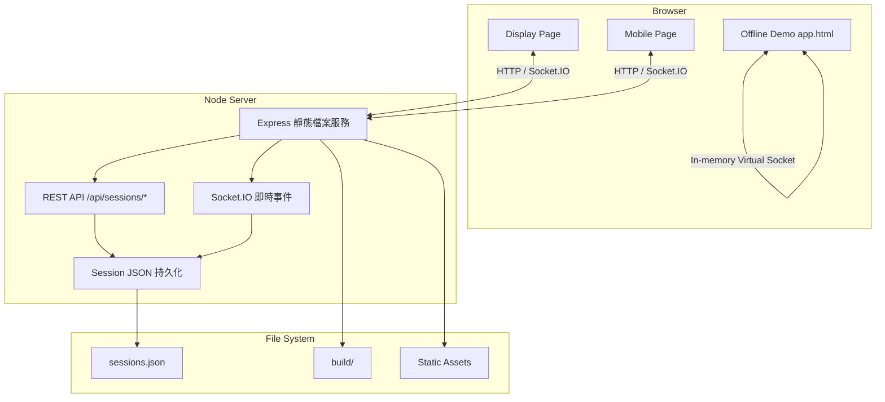
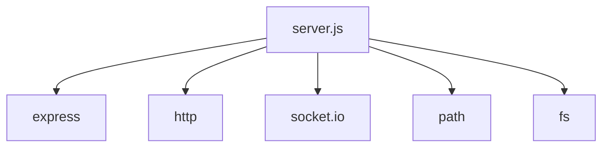
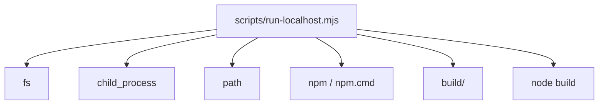
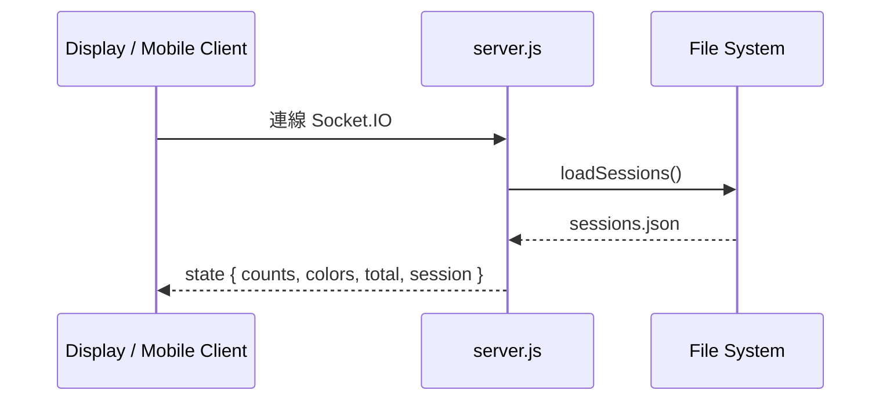
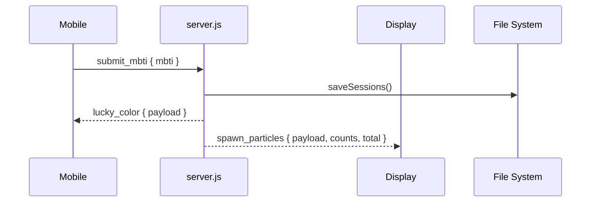
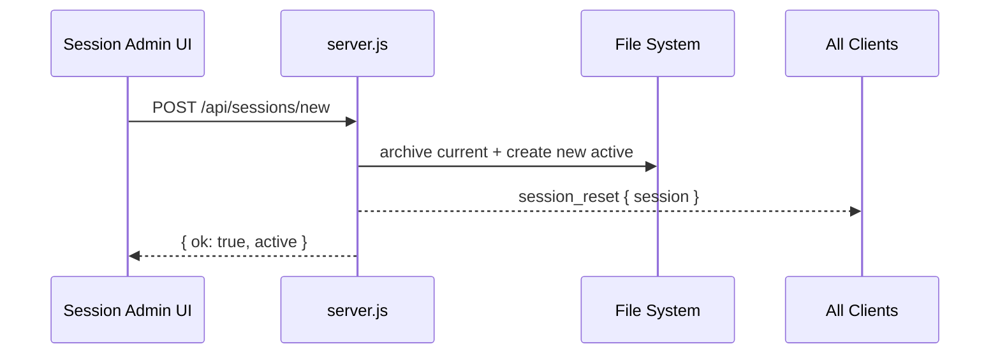

# InkLumina 專案架構說明書

> 版本：release/ref-sv-v3  
> 目的：完整說明專案整體架構、資料流、模組依賴、以及各子目錄與文件用途。  
> 範圍：以目前分支可見檔案為準，包含根目錄、`src/`、`static/`、`scripts/`、`prompts/`、`devnotes/`、`.github/`、`.vscode/`。

---

## 1. 專案總覽

InkLumina 是一個以 **SvelteKit + TypeScript + Vite** 建置的互動式粒子藝術專案，核心使用場景是：

- **Display 端**：大螢幕展示 MBTI 粒子畫布、臉部/手勢追蹤、QR code、現場狀態。
- **Mobile 端**：行動裝置加入互動、選擇 MBTI、送出資料。
- **Server 端**：使用 Node.js + Express + Socket.IO 提供即時同步、會話管理、靜態資源服務。
- **Offline Demo**：`app.html` 提供不依賴後端的單檔虛擬 socket 示範。

此專案同時包含：

- **正式 web app**：SvelteKit 架構
- **傳統 Node server**：`server.js`
- **展示用靜態頁**：`public/display.html`、`public/mobile.html`
- **離線互動頁**：`app.html`
- **一鍵啟動腳本**：Windows / macOS / local runner

---

## 2. 專案目錄樹

```text

inklumina/
├── .github/
│   ├── SKILL.md
│   └── copilot-instructions.md
├── .vscode/
│   └── extensions.json
├── devnotes/
│   ├── DEVNOTES.md
│   └── DEVNOTES_2026-05-07T170733Z.md
├── prompts/
│   ├── AGENTS.md
│   ├── README.md
│   ├── prompt_template.md
│   ├── ai/
│   ├── mapping/
│   └── tests/
├── scripts/
│   └── run-localhost.mjs
├── src/
│   ├── app.d.ts
│   ├── app.html
│   ├── hooks.server.ts
│   ├── lib/
│   └── routes/
├── static/
│   ├── entryMotion.html
│   ├── facemesh-with-hands-blank.webp
│   ├── facemesh-with-hands.webp
│   └── robots.txt
├── AGENTS.md
├── README.md
├── Start-InkLumina.bat
├── Start-InkLumina.command
├── .gitignore
├── .npmrc
├── package.json
├── package-lock.json
├── svelte.config.js
├── tsconfig.json
├── tsconfig.function.json
├── vite.config.ts
└── server.js

```

---

## 3. 系統架構總圖

### 3.1 邏輯分層



### 3.2 實作層次

```mermaid
flowchart TB
  Presentation[Presentation Layer]
  Interaction[Interaction Layer]
  Domain[Domain Layer]
  Infra[Infrastructure Layer]

  Presentation --> Interaction
  Interaction --> Domain
  Domain --> Infra

  Presentation --> ["display/mobile/offline HTML\nSvelteKit routes and components"]
  Interaction --> ["Socket.IO client/server\nvirtual socket\ncamera / media pipe / QR code UI"]
  Domain --> ["MBTI data\nsession management\ncounts / totals / lucky phrases"]
  Infra --> ["Express server\nfile system persistence\nVite / SvelteKit build\nNode runner scripts"]
```

---

## 4. 資料流圖

### 4.1 主要資料流：Mobile → Server → Display

```mermaid
flowchart LR
  A[Mobile 頁面]
  B[使用者選擇 MBTI]
  C[socket.emit('submit_mbti')]
  D[server.js]
  E[驗證 MBTI]
  F[更新 sessions.json]
  G[累加 counts / total]
  H[組出 payload]
  I[socket.emit('lucky_color')]
  J[io.emit('spawn_particles')]
  K[Display 頁面]
  L[接收 spawn_particles]
  M[產生粒子 / 更新 legend / 顯示 lucky phrase]

  A --> B --> C --> D --> E --> F --> G --> H
  H --> I
  H --> J
  I --> A
  J --> K --> L --> M
```

### 4.2 Session 資料流

```mermaid
flowchart TB
  A[server.js 啟動]
  B[loadSessions()]
  C[讀 sessions.json]
  D[若無 active session 則建立預設活動]
  E[REST API]
  F[GET /api/sessions]
  G[POST /api/sessions/new]
  H[GET /api/sessions/:id]
  I[DELETE /api/sessions/:id]
  J[Socket.IO]
  K[state]
  L[submit_mbti]
  M[session_reset]

  A --> B --> C --> D
  D --> E
  E --> F
  E --> G
  E --> H
  E --> I
  J --> K
  J --> L
  J --> M
```

### 4.3 Offline Demo 資料流

```mermaid
flowchart TB
  A[app.html]
  B[createVirtualSocket()]
  C[in-memory event bus]
  D[window.io()]
  E[emit / on]
  F[模擬 submit_mbti]
  G[模擬 spawn_particles]
  H[無後端 / 無持久化]

  A --> B --> C --> D --> E
  E --> F
  E --> G
  C --> H
```

---

## 5. 模組依賴圖

### 5.1 伺服器核心依賴



### 5.2 SvelteKit 前端依賴

```mermaid
graph TD
  svelteconfig[svelte.config.js]
  viteconfig[vite.config.ts]
  tsconfig[tsconfig.json]
  tsfunction[tsconfig.function.json]

  adapter[@sveltejs/adapter-node]
  kitvite[@sveltejs/kit/vite]
  vite[vite]
  plugin[socketIOPlugin]
  baseconfig[.svelte-kit/tsconfig.json]

  svelteconfig --> adapter
  viteconfig --> kitvite
  viteconfig --> vite
  viteconfig --> plugin
  tsconfig --> baseconfig
  tsfunction --> tsconfig
```

### 5.3 Runtime / build 流程依賴



### 5.4 前端展示依賴

```mermaid
graph TD
  display[public/display.html]
  mobile[public/mobile.html]
  offline[app.html]

  socketClient[/socket.io/socket.io.js/]
  qrcode[qrcodejs]
  faceMesh[@mediapipe/face_mesh]
  hands[@mediapipe/hands]
  cameraUtils[@mediapipe/camera_utils]
  virtualSocket[VirtualSocket]

  display --> socketClient
  display --> qrcode
  display --> faceMesh
  display --> hands
  display --> cameraUtils

  mobile --> socketClient

  offline --> virtualSocket
```

---

## 6. 根目錄逐檔說明

### 6.1 `README.md`
專案對外說明文件，包含：
- 專案簡介
- 離線 demo 的使用方式
- Node server 啟動方式
- Docker 啟動方式
- 常見問題與排錯

### 6.2 `AGENTS.md`
給 AI agent 的作業指南，包含：
- 開發命令
- 專案技術棧
- 變更原則
- UI 修改前需詢問
- TypeScript/Svelte 檢查要求

### 6.3 `package.json`
定義：
- 專案名稱與模組型態
- scripts
- devDependencies
- dependencies

### 6.4 `package-lock.json`
鎖定完整依賴樹，確保安裝結果一致。

### 6.5 `svelte.config.js`
SvelteKit 設定：
- 使用 `adapter-node`
- 強制 runes mode（排除 node_modules）

### 6.6 `vite.config.ts`
Vite 設定：
- SvelteKit plugin
- socketIOPlugin

### 6.7 `tsconfig.json`
主 TypeScript 設定：
- strict 模式
- bundler module resolution
- node types
- 排除特定 JS 路徑

### 6.8 `tsconfig.function.json`
供 `src/lib/function/` 的專用 TS 設定。

### 6.9 `Start-InkLumina.bat`
Windows 一鍵啟動腳本：
- 檢查 node / npm
- 安裝依賴
- 自動開頁
- 啟動 production-like localhost 版本

### 6.10 `Start-InkLumina.command`
macOS 一鍵啟動腳本：
- 檢查 node / npm
- 安裝依賴
- build production assets
- 啟動 localhost server
- 自動開啟 display 頁面

### 6.11 `.gitignore`
忽略：
- `node_modules`
- build output
- `.svelte-kit`
- OS junk
- `.env`
- session runtime data

### 6.12 `.npmrc`
設為 `engine-strict=true`。

---

## 7. `.github/` 子目錄說明

### 7.1 `.github/SKILL.md`
AI coding guideline 文件，內容偏向：
- 避免過度複雜
- 變更要外科手術式
- 先思考再寫
- 以可驗證目標為導向

### 7.2 `.github/copilot-instructions.md`
repository system prompt，重點：
- 角色定位：Svelte 5 重構專家
- 目標：將 HTML+JS PWA 邏輯遷移至 Svelte 5
- 要求：
  - 先掃描再轉換
  - TS first
  - 使用 runes
  - 保留文件註解
  - 每次修改後更新 `devnotes/`

---

## 8. `.vscode/` 子目錄說明

### 8.1 `.vscode/extensions.json`
推薦 VS Code 擴充套件：
- `svelte.svelte-vscode`

---

## 9. `devnotes/` 子目錄說明

### 9.1 `devnotes/DEVNOTES.md`
開發記錄索引與政策文件。

### 9.2 `devnotes/DEVNOTES_2026-05-07T170733Z.md`
單次快照文件，描述 session config 抽離等變更。

---

## 10. `prompts/` 子目錄說明

### 10.1 `prompts/README.md`
prompt 資產的存放規範。

### 10.2 `prompts/AGENTS.md`
子 agent 概念與用途說明。

### 10.3 `prompts/prompt_template.md`
prompt 標準模板。

### 10.4 `prompts/ai/`
AI 相關 prompt / 資產。

### 10.5 `prompts/mapping/`
prompt 對照、分類、映射資料。

### 10.6 `prompts/tests/`
prompt regression test cases。

---

## 11. `scripts/` 子目錄說明

### 11.1 `scripts/run-localhost.mjs`
Node 啟動輔助腳本：
- 若沒有 build 就先執行 `npm run build`
- 再啟動 build 產物
- 自動設定 HOST / PORT / ORIGIN

---

## 12. `src/` 子目錄說明

### 12.1 `src/app.d.ts`
全域型別宣告：
- `$state`
- `$derived`
- `$effect`
- `$props`
- `$app/environment`
- `$lib/config/settings`

### 12.2 `src/app.html`
SvelteKit HTML shell。

### 12.3 `src/hooks.server.ts`
目前是空檔。

### 12.4 `src/lib/`
核心共享模組區。

### 12.5 `src/routes/`
SvelteKit 路由與頁面/API 入口。

---

## 13. `static/` 子目錄說明

### 13.1 `static/entryMotion.html`
獨立的純 HTML 粒子互動示範頁。

### 13.2 `static/facemesh-with-hands.webp`
臉部與手勢追蹤示意圖。

### 13.3 `static/facemesh-with-hands-blank.webp`
另一版本示意圖。

### 13.4 `static/robots.txt`
搜尋引擎爬蟲控制檔，允許全部爬取。

---

## 14. `server.js` 架構說明

### 14.1 基本功能
- 啟動 Express server
- 提供靜態檔
- 路由導向
- Socket.IO 廣播與接收
- session 持久化
- REST API

### 14.2 Session 管理
使用 `sessions.json` 存：
- active session
- history sessions

API：
- `GET /api/sessions`
- `POST /api/sessions/new`
- `GET /api/sessions/:id`
- `DELETE /api/sessions/:id`

### 14.3 Socket.IO 事件
- `connection`
- `state`
- `submit_mbti`
- `lucky_color`
- `spawn_particles`
- `session_reset`

---

## 15. `app.html` 架構說明

### 15.1 特色
- 不依賴後端
- 內建 virtual socket
- 以單頁模擬 display + mobile 的事件流
- 不儲存資料

### 15.2 資料流
- `createVirtualSocket()`
- `window.io = function(){ return window.__virtualSocket; }`
- 模擬 `submit_mbti` / `spawn_particles`

---

## 16. `public/display.html` 架構說明

### 16.1 功能
- 顯示粒子畫布
- 載入 QR code
- 連接 Socket.IO
- 使用 MediaPipe 做 face mesh 與 hand tracking
- 顯示 emotion / hand badge / legend / totals / session UI

### 16.2 外部依賴
- Socket.IO client
- qrcodejs
- MediaPipe face mesh
- MediaPipe hands
- MediaPipe camera utils

### 16.3 內部邏輯
- `DRAW_MODE` 狀態機
- hand pinch 點計算
- camera toggle
- join QR code 生成
- session 面板
- 顯示模式的動態 loop

---

## 17. `public/mobile.html` 架構說明

### 17.1 功能
- 導引使用者選擇 MBTI
- 將 MBTI 發送到 server
- 顯示卡片 / 結果畫面
- 與 display page 透過 socket 同步

---

## 18. Mermaid 補充：關鍵業務流程

### 18.1 新連線與初始化流程



### 18.2 使用者提交 MBTI 流程



### 18.3 新場次建立流程



---

## 19. 這份架構文件的使用方式

建議閱讀順序：
1. 目錄樹
2. 系統架構總圖
3. 資料流圖
4. 模組依賴圖
5. 各子目錄逐檔說明
6. Mermaid 序列圖

---

## 20. 結論

InkLumina 是一個為現場互動展示打造的 MBTI 粒子藝術系統，結合：
- 即時 socket 同步
- MBTI 互動輸入
- 粒子視覺化
- 手勢/臉部追蹤
- session 持久化
- SvelteKit 遷移中的新架構

若用一句話總結：

> 這是一個為現場互動展示打造的 MBTI 粒子藝術系統，既保留傳統 Node/HTML runtime，也逐步向 Svelte 5 架構遷移。

---

